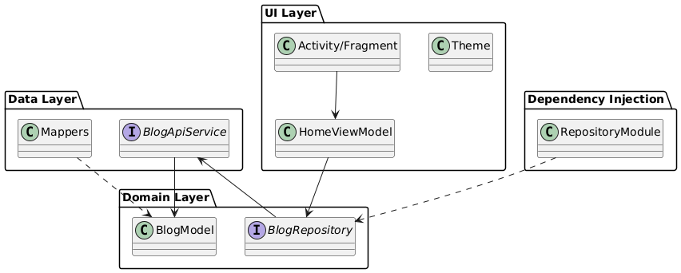

# BlogsApp

## Project Description

BlogsApp is an Android application designed to fetch and display blog posts. It allows users to view
a list of blog posts and potentially interact with them. The app is built using Kotlin and follows
modern Android development practices.

## Project Structure

The project is structured into several key components:

* **Data Layer**: Handles data operations.
    * `data/Mappers.kt`: Contains mapping functions to convert data models.
    * `data/services/BlogApiService.kt`: Defines the API interface for fetching blog data.
* **Domain Layer**: Contains the business logic.
    * `domain/models/BlogModel.kt`: Represents the data model for a blog post.
* **UI Layer**: Manages the user interface.
    * `ui/theme/Theme.kt`: Defines the application's visual theme, likely using Jetpack Compose.
    * `ui/viewmodels/HomeViewModel.kt`: Contains the UI logic for the home screen, preparing and
      managing data for display.
* **Dependency Injection**:
    * `di/modules/RepositoryModule.kt`: Provides repositories for dependency injection, likely using
      Hilt.

## Dependencies

The project utilizes several key Android libraries and third-party dependencies:

* **Kotlin**: The primary programming language.
* **Jetpack Compose**: For building the user interface.
* **Hilt**: For dependency injection.
* **Retrofit/OkHttp**: (Likely, based on `BlogApiService.kt`) For making network requests to fetch
  blog data.
* **ViewModel**: Part of Android Jetpack, used for `HomeViewModel.kt` to manage UI-related data in a
  lifecycle-conscious way.

To see the full list of dependencies, please refer to the `app/build.gradle.kts` and
`gradle/libs.versions.toml` files.

## Architectural Pattern

The project appears to be using a **Model-View-ViewModel (MVVM)** architectural pattern, possibly
combined with Clean Architecture principles.

* **Model**: Represented by `BlogModel.kt` and other data classes.
* **View**: Implemented using Jetpack Compose, managed by Activities/Fragments (not explicitly shown
  but implied).
* **ViewModel**: `HomeViewModel.kt` serves as the ViewModel, interacting with the data layer (via
  repositories) and exposing data to the View.

The separation into `data`, `domain`, and `ui` packages further suggests an adherence to layered
architecture, a common practice in Clean Architecture.

## PlantUML Diagram

You can find the PlantUML source file at `/diagrams/project.puml`.

To view the diagram, you can use a PlantUML renderer. Here is an example of how to embed the
rendered image (assuming you generate a `project.png` in the `/diagrams/` folder):

Alternatively, you can copy the content of `/diagrams/project.puml` and paste it into an online
PlantUML viewer.
